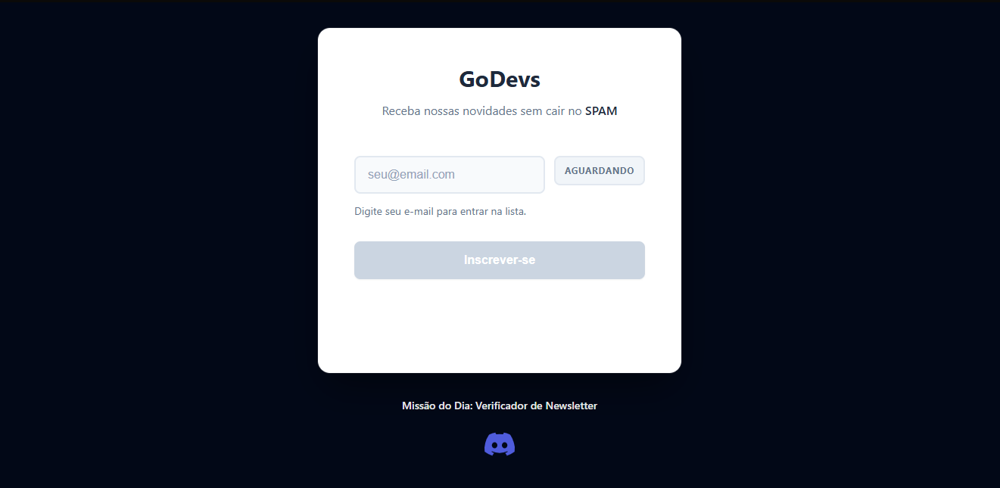
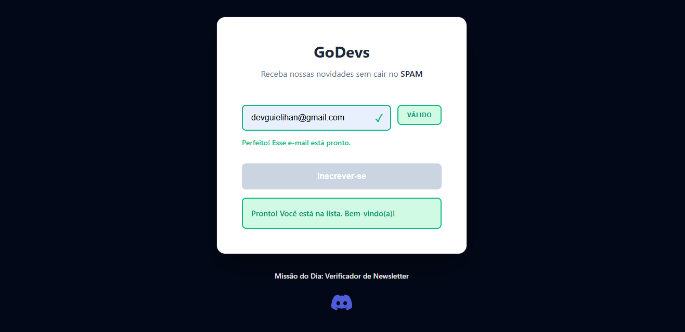
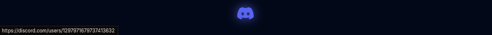

# 📬 Verificador de Newsletter


> **Missão do Dia: Verificador de Newsletter** - Sistema de validação de e-mail em tempo real com feedback visual instantâneo

## 📋 Sobre o Projeto

Um mini site moderno e responsivo desenvolvido com HTML, CSS e JavaScript puros (sem frameworks) que valida e-mails em tempo real enquanto o usuário digita. O projeto oferece uma experiência interativa com feedback visual imediato, animações suaves e acessibilidade completa.

### ✨ Funcionalidades Principais

- ✅ **Validação em tempo real** - Feedback instantâneo enquanto o usuário digita
- 🎨 **Feedback visual dinâmico** - Mudança de cores na borda do input (neutro, válido, inválido)
- 🏷️ **Status badge inteligente** - Badge que alterna entre "AGUARDANDO", "VÁLIDO" e "INVÁLIDO"
- 🔄 **Loading animado** - Spinner CSS no botão durante o envio simulado
- 💬 **Mensagens contextuais** - Textos de ajuda que se adaptam ao estado do input
- ♿ **Acessibilidade completa** - Labels adequados, aria-live e foco visível
- 📱 **Design responsivo** - Mobile first, adaptável a qualquer tela
- 🎯 **UX premium** - Transições suaves, microanimações e design moderno

## 🎯 Demonstração

### Preview da Interface



### Estados da Validação



### Ícone do Discord



## 🚀 Tecnologias Utilizadas

- **HTML5** - Estrutura semântica e acessível
- **CSS3** - Estilos modernos com variáveis CSS, flexbox e animações
- **JavaScript (ES6+)** - Validação com regex, manipulação do DOM e eventos

## 📦 Estrutura do Projeto

```
verificador-de-newsletter/
├── index.html          # Estrutura HTML
├── style.css           # Estilos e animações
├── script.js           # Lógica de validação
├── assets/
│   ├── discord.png     # Ícone do Discord
│   └── screenshots/    # Capturas de tela do projeto
├── .gitignore          # Arquivos ignorados pelo Git
└── README.md           # Documentação do projeto
```

## 🎨 Funcionalidades Técnicas

### Validação por Regex
```javascript
const EMAIL_REGEX = /^[a-zA-Z0-9._-]+@[a-zA-Z0-9.-]+\.[a-zA-Z]{2,}$/;
```

### Estados do Input
- **AGUARDANDO** - Campo vazio ou antes de digitar (borda padrão)
- **VÁLIDO** - E-mail em formato correto (borda verde + ícone ✓)
- **INVÁLIDO** - E-mail incompleto ou incorreto (borda vermelha + ícone ⚠)

### Loading Premium
- Spinner CSS puro (sem SVG externo)
- Tempo de simulação: 900ms - 1200ms aleatório
- Botão desabilitado durante o processo
- Texto muda para "Enviando..."

## 💻 Como Executar

1. **Clone o repositório**
```bash
git clone https://github.com/Guielihan/verificador-de-newsletter.git
```

2. **Navegue até a pasta**
```bash
cd verificador-de-newsletter
```

3. **Abra o arquivo HTML no navegador**
- Opção 1: Duplo clique no `index.html`
- Opção 2: Use Live Server no VS Code
- Opção 3: Arraste o arquivo para o navegador

## 🧪 Como Testar

1. **Digite um e-mail incompleto** (ex: `teste@`) → Veja a borda vermelha e mensagem de erro
2. **Complete o e-mail** (ex: `teste@email.com`) → Veja a borda verde e ícone de sucesso
3. **Clique em "Inscrever-se"** → Observe o loading animado com spinner
4. **Aguarde a mensagem de sucesso** → Campo é limpo automaticamente após 1s

## 🎯 Requisitos Implementados

### Funcionais
- [x] Validação no evento `input` (tempo real)
- [x] Borda muda de cor baseado na validade
- [x] Regex para validar formato de e-mail
- [x] Botão desabilitado até e-mail válido
- [x] Mensagem de sucesso sem recarregar página
- [x] Limpeza do campo após envio

### UI/UX
- [x] Layout centralizado com card elegante
- [x] Título e subtítulo informativos
- [x] Feedback visual com transições suaves
- [x] Textos de ajuda dinâmicos
- [x] Status badge ao vivo
- [x] Acessibilidade (labels, aria-live, foco)
- [x] Design responsivo mobile-first

### Premium
- [x] Loading no botão com spinner CSS
- [x] Texto "Enviando..." durante loading
- [x] Simulação de envio (900-1200ms)
- [x] Ícones de check e alerta
- [x] Microanimações (pop, pulse)
- [x] Mensagens amigáveis

## 🎨 Paleta de Cores

- **Fundo**: `#020817` (azul escuro profissional)
- **Card**: `#ffffff` (branco puro)
- **Primário**: `#6366f1` (roxo moderno)
- **Sucesso**: `#10b981` (verde)
- **Erro**: `#ef4444` (vermelho)
- **Neutro**: `#64748b` (cinza azulado)

## 📝 Licença

Este projeto foi desenvolvido como parte do **Missão do Dia** da plataforma GoDevs.

## 👨‍💻 Desenvolvedor

**Guilherme Queiroz (Guielihan)**

Desenvolvedor apaixonado por criar experiências web modernas e acessíveis.

### 📬 Contato

[](https://discord.com/users/1297971679737413632)
[](https://www.instagram.com/devguielihan/)
[](mailto:devguielihan@gmail.com)

### 🎓 Agradecimentos

Este projeto foi desenvolvido como parte do programa de estudos da plataforma **GoDevs**, criada pelo professor Luan.

[](https://github.com/in100tiva)
[](https://godevs.in100tiva.com/)

---

⭐ Se este projeto te ajudou, considere dar uma estrela no repositório!
